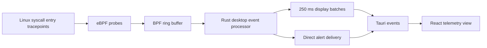

# Sentinella

Linux runtime security prototype built with Rust, eBPF/Aya, Tauri and React.

[](https://github.com/frenesyyyyy/SentinellaEDR/actions/workflows/ci.yml)

Sentinella explores the path from kernel events to a usable desktop telemetry
view: bounded event records, asynchronous processing, simple detection heuristics
and batching to keep frequent events from overwhelming the interface.

**Run only in a disposable Linux test environment.** The current eBPF probe
attempts to send SIGKILL when a process name or executable basename matches
`nc`, `ncat`, `netcat` or `socat`, including when the UI is in Learning mode.
That mode controls network baselining, not the kernel policy. The interface's
"Blocked" label does not confirm that the signal succeeded.

## How it fits together



The desktop attaches `execve`, `memfd_create` and IPv4 `connect` probes. It
filters selected names, learns process/IP pairs, and flags sufficiently regular
connection intervals. These are experimental heuristics, not proof of malware.
The separate `sentinella-core` library includes an exec-only loader and static
MITRE ATT&CK mapping; the current desktop telemetry path does not use that mapper.

## Engineering focus

- A shared, fixed-layout event contract across the kernel/userspace boundary.
- An asynchronous ring-buffer reader that keeps the loaded probes alive.
- Separate display batching and name-based policy modules, with regression tests.
- Explicit trade-offs around dropped events, limited context and false positives.

Start with [Architecture](ARCHITECTURE.md), then [Design decisions](DESIGN_DECISIONS.md)
and [Known limitations](KNOWN_LIMITATIONS.md). [Development notes](docs/DEVELOPMENT.md)
cover build steps, checks and a manual Linux validation plan.

## Build and check

The sensor requires Linux x86_64, a compatible kernel with BPF ring-buffer support
(introduced in Linux 5.8), and privileges to load/attach the probes. Kernel version
alone does not guarantee compatibility. Windows can build the frontend but cannot
run this sensor.

On Linux, after installing the prerequisites in the development notes:

```sh
cargo xtask build-ebpf
cd apps/desktop
npm ci
npm run build
npm run tauri build -- --debug --no-bundle
```

The last command builds without starting the sensor. Read the limitations before
running the resulting binary with elevated privileges in a disposable VM.

CI checks Rust formatting, Clippy, unit tests, the frontend build and compilation
of the eBPF object and desktop. It does not attach probes or prove runtime safety.
No reproducible performance benchmark or broad kernel compatibility matrix is
included. Historical binaries remain on the [releases page](https://github.com/frenesyyyyy/SentinellaEDR/releases);
their labels are not a guarantee that they match the current source or audit.

## Development approach

AI tools were used during development and this cleanup. The useful review surface
is the code, the documented constraints and the checks, rather than an estimate of
how much was typed manually. [Engineering review notes](docs/ENGINEERING_REVIEW.md)
separate verified source behavior from work still needed.

MIT license; see [LICENSE](LICENSE).
